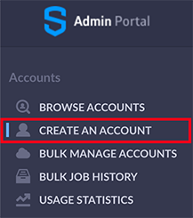
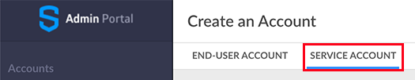
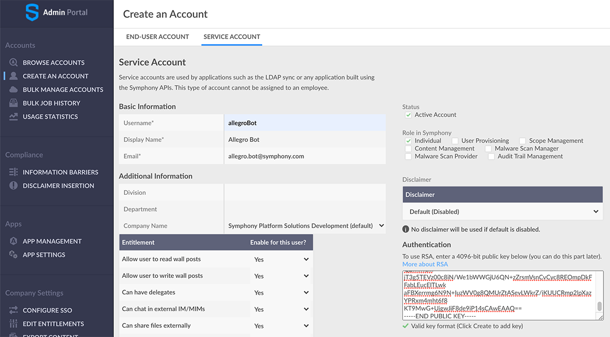

# Create A Service Account

The Allegro API allows you to access Symphony as a Service Account, if you have an existing account which
you have used for bot development then you can skip this section.

## Create an RSA Key Pair

The API will authenticate to Symphony using an RSA key pair, the first step is to create a key pair.

You can create a key pair using openssl as follows:

```sh
$ cd
$ openssl genrsa -out allegroBotKey.pem 4096
Generating RSA private key, 4096 bit long modulus
...........................................++
.........................++
e is 65537 (0x10001)
$ openssl rsa -in allegroBotKey.pem -pubout -out allegroBotPubKey.pem
writing RSA key
$
```

In this example we are creating the key files in our home directory, you can, of course, save these files wherever
you find convenient.

The __allegroBotPubKey.pem__ file contains the public half of the key pair, which as the name suggests, can
be made public, and needs to be uploaded to your Symphony Pod via the Admin and Compliance portal.

The __allegroBotKey.pem__ file contains the _private_ half of the key pair, this must be kept secret, possession
of this key enables the holder to authenticate to Symphony. This file should be carefully protected and
should be owned by, and read only to, the operating system account as which the bot or application executes.

## Create A Symphony Service Account

In the Symphony Admin and Compliance Portal, create a Service Account, select the create an account option
from the left nav:



and then 



from the top menu, then enter the details of the account (name, email address etc.).
Paste the contents of the __allegroBotPubKey.pem__ file into the __Authentication__ field, as shown.



Finally, click __Create__ to create the account.