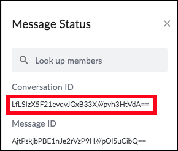

# ToDo List Example
The ToDo List Example is a small set of programs which demonstrate how to store and retrieve a small collection
of data objects. In this case we will manage a list of ToDo items, each of which is represented by a JSON
data structure defined as a [Canon](https://canon.oss.symphony.com/) Schema.

The schema for a ToDo item (which is defined in the [canon schema](https://github.com/SymphonyOSF/oss-allegro-examples/blob/master/calendar/src/main/canon/calendar.json#L19)) looks like this:

```json
      "ToDoItem": {
        "description": "A TODO item.",
        "type": "object",
        "extends": "https://models.oss.symphony.com/object.json#/components/schemas/ApplicationObjectPayload",
        "properties": {
          "due": {
            "$ref": "https://models.oss.symphony.com/core.json#/components/schemas/Instant"
          },
          "title": {
            "type": "string"
          },
          "description": {
            "type": "string"
          },
          "timeTaken": {
            "$ref": "https://models.oss.symphony.com/core.json#/components/schemas/BigDecimal"
          }
        }
      }
```

As you can see, a ToDo item consists of:

+ A Due date (An Instant is a timestamp with up to nanosecond resolution).
+ A title
+ A description

When serialised a ToDo item looks like this:

```
{
  "_type":"com.symphony.s2.model.calendar.ToDoItem",
  "_version":"1.0",
  "description":"Since we are creating this item with a due date of Instant.now() we are already late!",
  "due":"2019-08-07T23:12:52.645Z",
  "title":"An example TODO Item"
}
```

Each ToDo Item is stored as an encrypted object in the Symphony Object Store. All objects in the Object Store are
encrypted and immutable, but we can create new versions of an object which can replace the previous version when
we want to update an item.

Objects in the Object Store can optionally have a header object which is stored *in clear text*. This can be useful to
allow server side processes to perform some operations on objects, but the header object is unencrypted and therefore
insecure. Header objects should contain only timestamps, IDs and public information. These examples define this
header object for ToDo items:

```json      
      "ToDoHeader": {
        "type": "object",
        "extends": "https://models.oss.symphony.com/object.json#/components/schemas/ApplicationObjectHeader",
        "description": "Header type for calendar objects.",

        "properties": {
          "due": {
            "$ref": "https://models.oss.symphony.com/core.json#/components/schemas/Instant"
          },
          "requestingUser": {
            "$ref": "https://models.oss.symphony.com/core.json#/components/schemas/PodAndUserId"
          },
          "affectedUsers": {
            "type": "array",
            "x-canon-cardinality": "SET",
            "items": {
              "$ref": "https://models.oss.symphony.com/core.json#/components/schemas/PodAndUserId"
            }
          },
          "podId": {
            "$ref": "https://models.oss.symphony.com/core.json#/components/schemas/PodId"
          },
          "effectiveDate": {
            "$ref": "https://models.oss.symphony.com/core.json#/components/schemas/Instant"
          }
        }
      }
    }
```


See [The Symphony 2.0 Object Store](https://allegro.oss.symphony.com/ObjectStore.html) on the Allegro API site
for more details about the object model.

We shall create a Partition to hold a set of ToDo items, a Partition is just a data set containing some collection of records.
You can create partitions to organize your data in whatever way your application requires, but each object is a member of
exactly one Partition. Each object has a *PartitionKey* which determines which Partition it is a member of and a 
*SortKey* which determines the object's position in the Partition. You can choose the SortKey for your object, and when
the object is updated this SortKey can even be changed. The SortKey for each object must be unique within the Partition.
If you intend to use a value for a SortKey which could potentially be duplicated, such as a time stamp, we recommend that
you append the object's **baseHash** to the value to prevent collisions.

## Set Up a Chat Room
In order to run these examples you need to create a chat room and add your bot user to the room.
Then click on the timestamp of any message in that room to display the __Message Status__ panel:



Make a note of the ConversationId, this needs to be presented to the example programs as the Environment
Variable __ALLEGRO_THREAD_ID__.